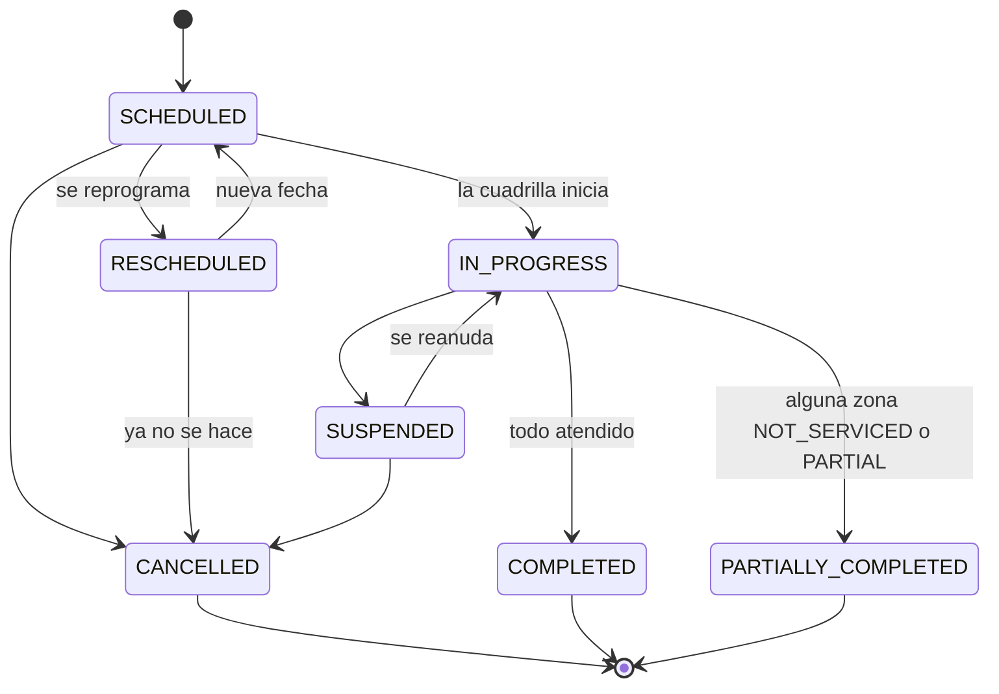

# `Service` — la entidad central

Un **`Service`** es toda unidad de trabajo programable del módulo: siempre tiene tipo, fecha, ventana horaria, cuadrilla, vehículo si corresponde, estado y evidencia. Lo que varía es sobre qué se ejecuta.

| `mode` | Objetivo | Ejemplo | Resultado |
|---|---|---|---|
| `ROUTE` | Secuencia ordenada de zonas | Recolección domiciliaria Zona Norte | Un `ZoneResult` por zona |
| `POINT` | Un bien del inventario o una ubicación | Vaciar el contenedor CT-0442; podar el árbol TR-01293 | Un único resultado |

Todo `Service` lleva `zoneIds[]` y **nunca viene vacío**: las zonas del recorrido en `ROUTE`, una sola en `POINT`. Se copia al programar y no se recalcula, para que editar un recorrido no altere lo ya ejecutado.

En `POINT` la zona sale del bien del inventario, o del barrio de la dirección si el objetivo es una ubicación suelta.

Las podas y las inspecciones ambientales también son servicios: [`TreeIntervention`](tree-intervention.md) y [`EnvironmentalInspection`](control-ambiental.md) guardan **qué** hay que hacer, y el `Service` **cuándo**, con qué cuadrilla y cómo terminó.

## Campos

| Entidad | Campos principales |
|---|---|
| `Service` | `serviceTypeId`, `mode`, `zoneIds[]`, `routeId` \| `targetRef`, `scheduledDate`, `timeWindow`, `crewId`, `vehicleId`, `status`, `statusReason`, `origin`, `ticketId`, `weatherAlertId`, `attachments[]`, `notes`. `crewId` es opcional hasta que se asigna la cuadrilla. `assignmentOverrideNote` / `By` / `At` solo se llenan si la asignación o la programación se hizo **sobre un solapamiento** |
| `ServiceDelayNotice` | Hijo de un `Service`, uno por aviso de demora. `delayType`, `delayMinutes`, `reason`, `newEstimatedEnd`, `serviceStatus`, `reportedBy`, `detectedAt`, `supersededById`. El vigente es el que no fue reemplazado |
| `ZoneResult` | Hijo de un `Service` con `mode = ROUTE`, uno por zona. `zoneId`, `status`, `reason`, `proposedDate`, `notes`, `attachments[]`, `recordedAt` |
| `CollectionRecord` | `wasteType`, `volumeM3`, `weightKg`, `disposalSiteId` |
| `DisposalSite` | `code`, `siteType`, `name` |

Referencias a otras entidades: `serviceTypeId` → [`ServiceType`](configuracion-y-recursos.md#servicetype), `routeId` → [`Route`](configuracion-y-recursos.md#route), `crewId` → [`Crew`](configuracion-y-recursos.md#crew), `vehicleId` → [`Vehicle`](configuracion-y-recursos.md#vehicle), `zoneIds[]` → [`Zone`](configuracion-y-recursos.md#zone). `targetRef` apunta a un bien de [inventario urbano](inventario-urbano.md) o a un [`Container`](container.md).

Enums: `mode` es `ServiceMode`, `status` es `ServiceStatus`, `origin` es `ServiceOrigin`, `ZoneResult.status` es `ZoneResultStatus`, `ZoneResult.reason` es `NotServicedReason`, `wasteType` es `WasteType`, `siteType` es `DisposalSiteType` — ver [enumeraciones.md](../enumeraciones.md).

`ticketId` es de M2 y viaja solo cuando `origin = TICKET`. Es lo único que necesitamos guardar para correlacionar. `expectedTicketVersion` salió del contrato en la v1.5. `publicId` volvió en la v1.70 como referencia humana, pero el `Service` no lo guarda: el `ticketId` entra por `POST /services` y no hay de dónde tomar el `publicId` (ver #145 y [`updateTicketStatus`](../eventos/publicados/updateTicketStatus.md)).

**Vínculo con la inspección y la alerta (#218).** `POST /services` acepta `inspectionId` solo con `origin = INSPECTION` y `weatherAlertId` solo con `origin = WEATHER_ALERT`; ninguno es obligatorio, porque hay servicios de esos orígenes sin ese id (una poda que sale de un relevamiento de arbolado, o un servicio que se agenda a mano después de una alerta). El vínculo con la inspección **se guarda una sola vez, en `EnvironmentalInspection.serviceId`**: el alta con `inspectionId` escribe ese campo en la misma transacción (404 si la inspección no existe, 409 si ya tiene servicio, 400 si el tipo no es `POINT`), y la respuesta del servicio lo lee de ahí. `weatherAlertId` sí es una columna del servicio: la alerta es simulada y M6 no la persiste, así que es una referencia sin FK que no se verifica. Ninguno de los dos viaja en `urbanServiceScheduled`.

## Estados

El mismo diagrama vale para `mode = ROUTE` y para `mode = POINT`.

`DELAYED` **no es un estado**: es un aviso, y vive en su propia tabla. El servicio sigue en `SCHEDULED` o en `IN_PROGRESS` mientras se demora, y esos son los dos únicos momentos en los que un retraso significa algo — uno cerrado ya no se demora, y uno suspendido tiene su motivo en `statusReason`.

El tipo tiene que coincidir con el momento: `START` es empezar tarde y solo aplica antes de arrancar; `DURATION` es tardar más, y solo aplica con la cuadrilla trabajando. Aceptar la combinación cruzada dejaría entrar datos que después nadie sabe leer.

Los avisos se acumulan. Uno nuevo **reemplaza** al vigente (`supersededById`) en vez de pisarlo, y el reemplazado queda en el historial: un aviso emitido no se corrige, se emite otro — el mismo criterio que el acta.

## Asignar sobre un solapamiento

El mismo criterio rige al programar con `crewId`/`vehicleId` en `POST /services` (acepta `overrideNote`) y al cambiar el vehículo o la ventana con `PATCH /services/:id`, que evalúa los valores vigentes mezclados con los nuevos y no consulta nada si solo cambian las notas.

Que la cuadrilla esté tomada ese día en una franja que se pisa **avisa, no bloquea**. La realidad de la calle gana: a veces la misma cuadrilla hace dos cosas y quien planifica lo sabe. Sin `overrideNote` la asignación rebota con 409 nombrando los servicios en conflicto; con la nota se hace igual y queda registrado quién decidió y cuándo.

En `PATCH /services/:id`: un PATCH de solo `vehicleId` **no** revisa la cuadrilla vigente (a propósito, para que un solapamiento previo de la cuadrilla no trabe una corrección de vehículo); un PATCH que cambia la ventana revisa la cuadrilla y el vehículo vigentes; `vehicleId: null` quita el vehículo sin chequeo. El chequeo va antes de escribir y sin lock: dos operaciones concurrentes podrían pasar las dos.

La nota se guarda **solo si hubo solapamiento**. Guardarla siempre dejaría rastro de un override que nunca ocurrió.

`assignmentOverrideNote` / `By` / `At` son campos de auditoría: se guardan en la base pero **no se exponen** en `ServiceResponseDto` (por ahora).

Una franja horaria ausente se trata como **todo el día**: es lo único honesto cuando no sabemos cuándo empieza, y suponer lo contrario haría desaparecer el aviso justo donde menos información hay. `GET /services/:id/assignment-conflicts` existe para poder avisar antes de enviar — el 409 es la red, no el camino.

**`RESCHEDULED` no obliga a reprogramar.** Es el estado "hay que moverlo pero todavía no sé adónde", y el sistema mete servicios ahí solo: lo hacen el rechazo de un corte de calle de M7 y la alerta meteorológica. Si el motivo es definitivo —M7 rechaza el corte porque hay obra por dos meses— cancelar es la decisión correcta y sale directo, sin pasar por una fecha inventada.

## Qué publica

- Al agendarse: [`urbanServiceScheduled`](../eventos/publicados/urbanServiceScheduled.md) → M7.
- Si nació de un reclamo (`origin = TICKET`), cada cambio relevante dispara un [`updateTicketStatus`](../eventos/publicados/updateTicketStatus.md) → M2. **Si no hay `ticketId`, no sale nada hacia M2**: un servicio planificado —la recolección de todos los martes— no proyecta.

Un aviso de demora sobre un servicio nacido de un reclamo sale como `updateTicketStatus / PROGRESS`: el motivo viaja como mensaje interno, al vecino se le dice que se demora y no por qué.

Los hechos de inicio, demora, cierre y zona no atendida existen en el modelo pero **no salen al bus** como tales: ver [descartados.md](../eventos/publicados/descartados.md).
